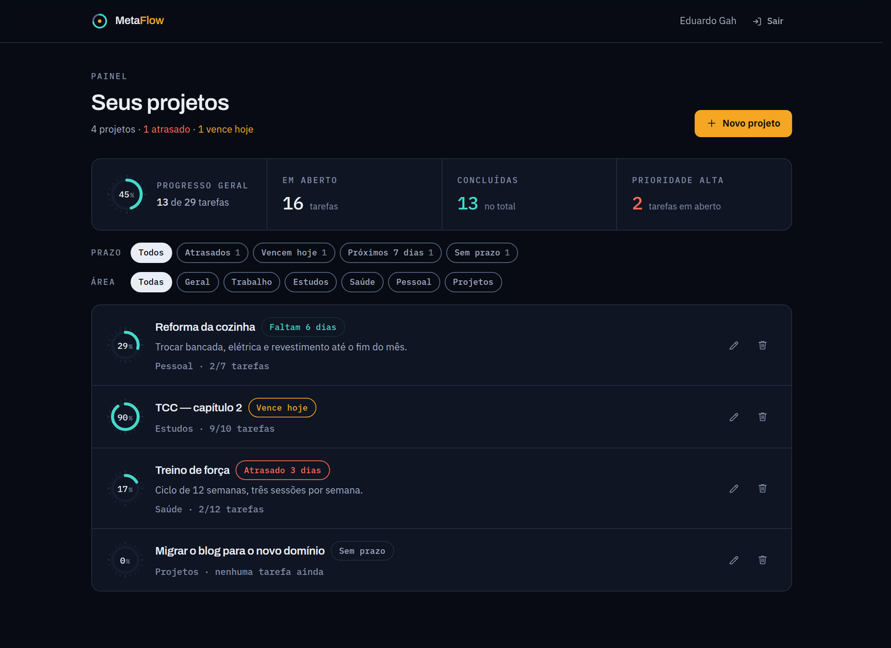
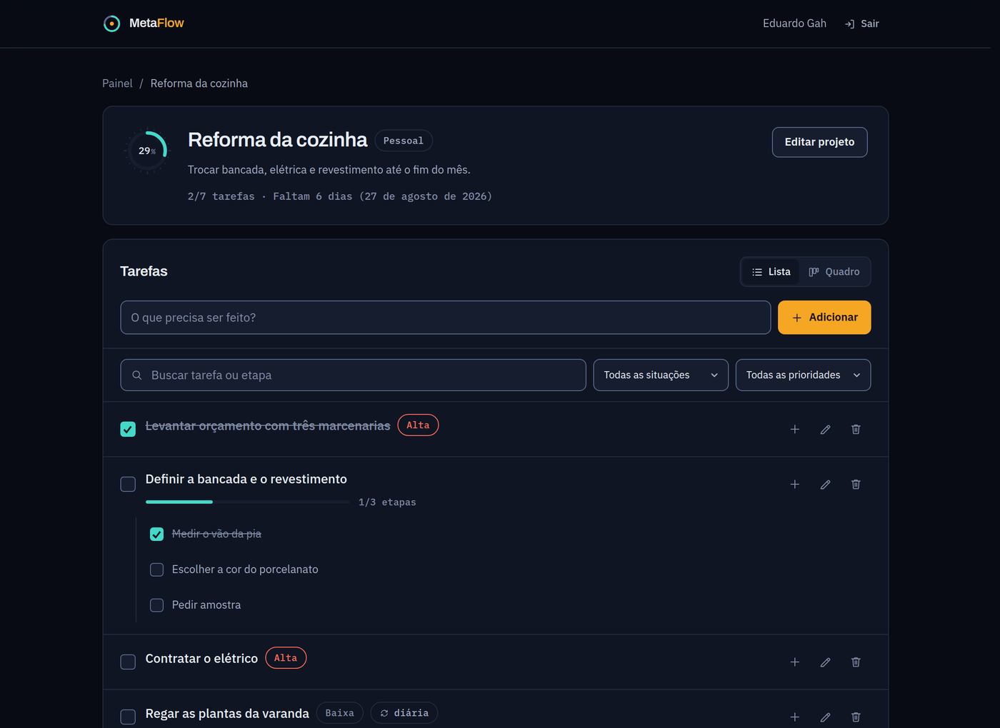
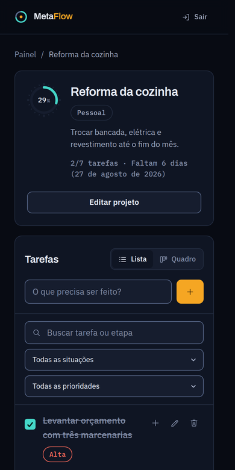

<div align="center">


# MetaFlow

**Uma meta só avança quando vira tarefa.**

Aplicativo web para dividir projetos pessoais em tarefas e subtarefas.
O percentual de progresso é calculado a partir do que foi concluído — não existe barra para arrastar.

[Como executar](#como-executar) · [Arquitetura](#arquitetura) · [Decisões](#decisões-de-projeto) · [Publicação](#publicação)

</div>



<sub>Painel com projetos de exemplo.</sub>

---

## O que ele faz

| | |
| --- | --- |
| **Projetos com prazo e área** | Cada projeto pertence a uma área (Trabalho, Estudos, Saúde… ou as suas) e pode ter uma data-alvo. |
| **Tarefas e subtarefas** | Duas camadas de profundidade. A prioridade fica na própria tarefa; subtarefas herdam o ciclo da tarefa-mãe. |
| **Progresso calculado** | O percentual vem da razão entre tarefas concluídas e totais. Ninguém digita "70% pronto". |
| **Tarefas recorrentes** | Sete intervalos, de 15 minutos a semanal. Vencido o intervalo, a tarefa volta para "a fazer" ao abrir o projeto. |
| **Lista e quadro kanban** | A mesma informação em duas leituras: lista para trabalhar item a item, quadro para ver o que travou. |
| **Leitura de prazo** | Atrasado, vence hoje, faltam N dias. O painel filtra por essas situações em vez de exigir comparação de datas. |
| **Instalável (PWA)** | Abre direto no painel a partir da tela inicial do celular ou do desktop. |
| **Isolamento por conta** | Feito por Row Level Security no PostgreSQL, não por verificação na interface. |

---

## Pilha

| Camada | Escolha | Por quê |
| --- | --- | --- |
| Interface | React 19 · TypeScript estrito · Vite 8 | Build rápido, tipos verificados no `npm run build`. |
| Rotas | react-router-dom 7 | Divisão de código por rota, com as telas autenticadas sob demanda. |
| Estilo | Tailwind CSS 3 sobre tokens em CSS custom properties | Um vocabulário só, consumido por Tailwind e por CSS puro. |
| Tipografia | Archivo (variável) · IBM Plex Sans · IBM Plex Mono | Auto-hospedadas: nenhuma requisição a terceiros. |
| Dados e sessão | Supabase — PostgreSQL, Auth com Google (PKCE), RLS | Back-end gerenciado com autorização no banco. |
| PWA | vite-plugin-pwa (Workbox) | Instalação e casca offline. |
| Qualidade | oxlint · vitest | Lint e testes da lógica de negócio. |

**Sete dependências de runtime** — três delas são arquivos de fonte. Não há biblioteca de ícones
(os nove ícones em uso estão em `src/components/Icon.tsx`), nem biblioteca de animação
(o movimento é CSS), nem utilitário de classes (são seis linhas em `src/lib/utils.ts`).

---

## Como executar

Requisitos: Node.js 20 ou superior e um projeto no Supabase.

```bash
git clone https://github.com/EduuGah/metaflow.git
cd metaflow
npm install
cp .env.local.exemple .env.local   # preencha as variáveis
npm run dev
```

### Variáveis de ambiente

```bash
# Obrigatórias
VITE_SUPABASE_URL=https://<seu-projeto>.supabase.co
VITE_SUPABASE_ANON_KEY=<chave anon>

# Opcional — o domínio de produção, com esquema. Gera as URLs canônicas, as
# tags Open Graph e o sitemap.xml no build. Deixe vazia em desenvolvimento:
# sem ela o app usa a origem atual do navegador, que é o correto localmente.
VITE_SITE_URL=https://<seu-dominio>
```

> [!IMPORTANT]
> Use **somente** a chave `anon`. Ela é pública por desenho — identifica o projeto, não o
> usuário — e todo o controle de acesso mora nas políticas do banco. A chave `service_role`
> ignora essas políticas e nunca deve chegar ao navegador.
> O `.env.local` já é ignorado pelo git (regra `*.local`).

Sem as variáveis o app não quebra em tela branca: exibe uma tela explicando o que falta.

### Comandos

| Comando | O que faz |
| --- | --- |
| `npm run dev` | Servidor de desenvolvimento |
| `npm run build` | Checagem de tipos (`tsc -b`) e build de produção |
| `npm run preview` | Serve o build local |
| `npm run lint` | oxlint |
| `npm test` | 25 testes unitários de prazos, recorrência, progresso e redação de logs |

---

## Arquitetura

```
src/
├── components/          peças de interface reutilizáveis
│   └── task/            lista, quadro e selos de tarefa
├── context/             AuthContext (sessão) · ToastContext (avisos)
├── lib/                 lógica pura e integrações — sem JSX
│   └── __tests__/       testes da lógica de negócio
├── pages/               uma por rota
├── types/               contratos das tabelas
└── index.css            tokens do design system
```

**`src/lib` não conhece React.** Classificação de prazo, reabertura de tarefas recorrentes,
cálculo de progresso e redação de dados sensíveis em log são funções puras — por isso são
testáveis sem montar componente nem subir banco.

**Uma assinatura de sessão para o app inteiro.** `AuthProvider` resolve a sessão uma vez e
propaga; o cliente do Supabase entra por import dinâmico, então a página pública não carrega
os 208 kB dele para renderizar texto.

<table>
<tr>
<td width="66%"></td>
<td width="34%"></td>
</tr>
<tr>
<td align="center"><sub>Tela de projeto — visão em lista</sub></td>
<td align="center"><sub>A mesma tela no celular</sub></td>
</tr>
</table>

**Rotas**

| Rota | Acesso |
| --- | --- |
| `/` | pública — apresentação do produto |
| `/login` | pública |
| `/privacidade`, `/termos` | públicas |
| `/dashboard` | autenticada |
| `/dashboard/:id` | autenticada |
| `*` | página 404 própria |

### Banco de dados

Duas tabelas, `projects` e `tasks`, com RLS ligado. As políticas limitam cada linha ao seu
dono (`auth.uid() = user_id` em `projects`; em `tasks`, pelo vínculo com `project_id`).
A aplicação nunca filtra por usuário no cliente — quem separa as contas é o banco.
`tasks.parent_id` aponta para a tarefa principal quando a linha é uma subtarefa.

---

## Decisões de projeto

<details>
<summary><strong>O mostrador é o produto, não um enfeite</strong></summary>

<br>

O anel de progresso aparece em três lugares — resumo do painel, linha de projeto e cabeçalho
do projeto — sempre lendo a mesma coisa. As marcações só são desenhadas acima de 44px, porque
abaixo disso viram ruído. O número fica em mono tabular, então não "dança" ao ir de 9% para 10%.
A marca do produto é esse mesmo desenho congelado em 72%: o logotipo é a peça de interface
mais usada, não um símbolo à parte.

</details>

<details>
<summary><strong>Três acentos, significado fixo</strong></summary>

<br>

Âmbar é ação e atenção. Ciano é progresso e conclusão. Coral é risco. Nenhuma cor entra por
decoração, e só a ação principal da tela recebe âmbar. Todos os pares texto/superfície foram
medidos: mínimo de 4.5:1 para texto e 3:1 para bordas de controle. Os valores medidos estão
comentados ao lado de cada token em `src/index.css`.

</details>

<details>
<summary><strong>O celular não é o desktop espremido</strong></summary>

<br>

Diálogos sobem como folha inferior, ao alcance do polegar. A ação principal do painel vira
barra fixa no rodapé, respeitando a área segura. O quadro kanban rola na horizontal com
encaixe e deixa uma fresta da próxima coluna à mostra. Descrições de projeto somem — cortadas
em uma linha não informam nada e o espaço vale mais para o título.

</details>

<details>
<summary><strong>Aviso só quando há algo a dizer</strong></summary>

<br>

Marcar uma tarefa não dispara aviso na tela: o sucesso já está visível na caixa marcada, e
quem conclui dez subtarefas seguidas não quer dez mensagens. A alteração é otimista e desfaz
sozinha se a escrita falhar. Para leitores de tela, cada mudança é anunciada em uma região
`aria-live`. Avisos idênticos em sequência viram um só, e a contagem para desaparecer pausa
com o ponteiro ou o foco em cima.

</details>

<details>
<summary><strong>Erro do banco não vai cru para a tela</strong></summary>

<br>

Mensagens do PostgreSQL revelam nomes de tabela, coluna e política. Tudo passa por
`src/lib/logger.ts`, que traduz os códigos conhecidos para linguagem comum e redige
token, senha e e-mail antes de qualquer escrita em log. O mesmo módulo tem um ponto de
extensão para um coletor externo, sem tocar em nenhum componente.

</details>

<details>
<summary><strong>Movimento que funciona desligado</strong></summary>

<br>

Nenhuma animação carrega informação sozinha. Transições existem para estados — foco, seleção,
carregamento, entrada de diálogo — e duram entre 130 e 260 ms. `prefers-reduced-motion`
desliga tudo, menos o giro dos indicadores de carregamento, que comunicam que algo está em
curso. O layout foi desenhado para ficar bom parado.

</details>

---

## Qualidade

| | |
| --- | --- |
| **Tipos** | `strict` ligado; a build falha em erro de tipo |
| **Testes** | 25 testes sobre a lógica de negócio, incluindo o caso de fuso horário que fazia prazos recuarem um dia |
| **Acessibilidade** | Navegação por teclado, foco preso em diálogos com devolução ao elemento de origem, rótulo em todo campo, `aria-live` para mudanças silenciosas, zoom liberado, contraste AA |
| **Responsividade** | Verificada de 320px a 1920px, sem overflow horizontal |
| **Performance** | 82 kB gzip no carregamento inicial; cliente do Supabase em pedaço separado, sob demanda |
| **Segurança** | CSP, HSTS, `X-Content-Type-Options`, `Referrer-Policy`, `Permissions-Policy` e COOP; OAuth por PKCE |
| **SEO** | Título, descrição e canônica por rota; Open Graph; `robots.txt`; sitemap gerado no build; dados estruturados |

---

## Publicação

Preparado para Vercel. O `vercel.json` traz o rewrite de SPA, os cabeçalhos de segurança e o
cache imutável dos arquivos com hash.

1. Defina `VITE_SUPABASE_URL`, `VITE_SUPABASE_ANON_KEY` e `VITE_SITE_URL` nas variáveis do projeto.
2. Inclua a URL de produção na lista de redirecionamentos permitidos do Supabase Auth.
3. As telas autenticadas já saem com `noindex`; o `robots.txt` mantém os rastreadores fora delas.

---

<div align="center">
<sub>Feito por <a href="https://github.com/EduuGah">Eduardo</a></sub>
</div>
